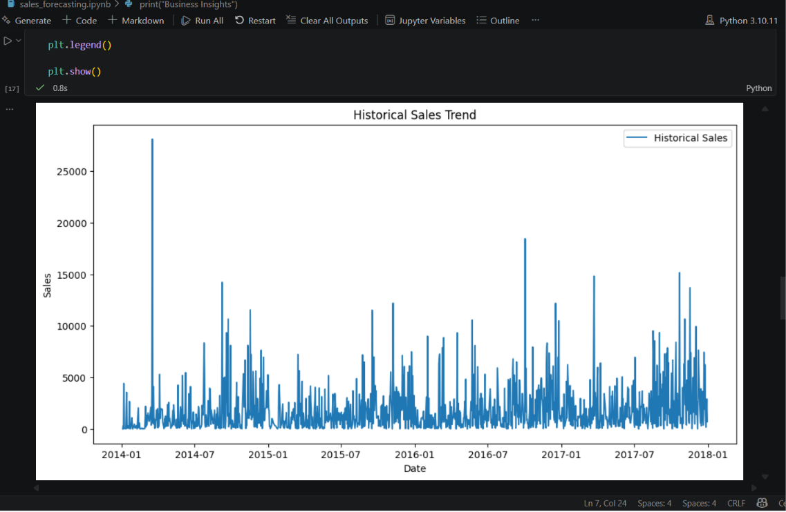
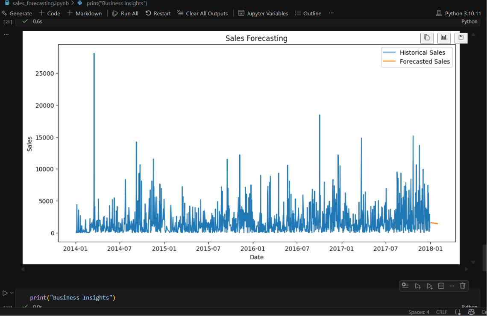

# FUTURE_ML_01
Sales Forecasting Machine Learning Project
# FUTURE_ML_01 - Sales Forecasting Project
## Project Overview
This project focuses on forecasting future sales using historical retail business data.  
The goal is to help businesses make better decisions related to inventory management, staffing, budgeting, and demand planning.

## Objective
To build a Machine Learning model capable of predicting future sales trends based on historical data and present the results using clear business-friendly visualizations.

## Technologies & Tools Used

- Python
- Pandas
- NumPy
- Matplotlib
- Scikit-learn
- Jupyter Notebook
- VS Code
- GitHub

## 📂 Dataset Used
Superstore Sales Dataset

The dataset contains:
- Order Date
- Sales
- Product Categories
- Regions
- Customer Information
- Profit & Quantity

## Features Implemented

-Data Cleaning  
-Handling Missing Values  
-Time-Based Feature Engineering  
-Sales Forecasting using Linear Regression  
-Model Evaluation using MAE & RMSE  
-Historical Sales Visualization  
-Future Sales Prediction  
-Business Insights Generation  

## 📊 Model Workflow

1. Imported and cleaned sales dataset  
2. Converted order dates into datetime format  
3. Created time-based features:
   - Year
   - Month
   - Day
   - Weekday
4. Trained Linear Regression forecasting model  
5. Evaluated forecasting accuracy  
6. Predicted future sales trends  
7. Visualized forecast results using Matplotlib  

##  Business Insights

- Forecasting helps estimate future sales demand
- Businesses can optimize inventory planning
- Seasonal trends help staffing decisions
- Forecasting reduces overstocking and losses

##  Output Visualizations

### Historical Sales Trend

### Forecasted Sales Trend

## Future Improvements

- ARIMA Time-Series Forecasting
- Random Forest Regressor
- Power BI Dashboard
- Streamlit Deployment
- Deep Learning Forecasting Models

## Conclusion

This project demonstrates how Machine Learning can support real-world business decision-making through sales forecasting and data-driven insights.
